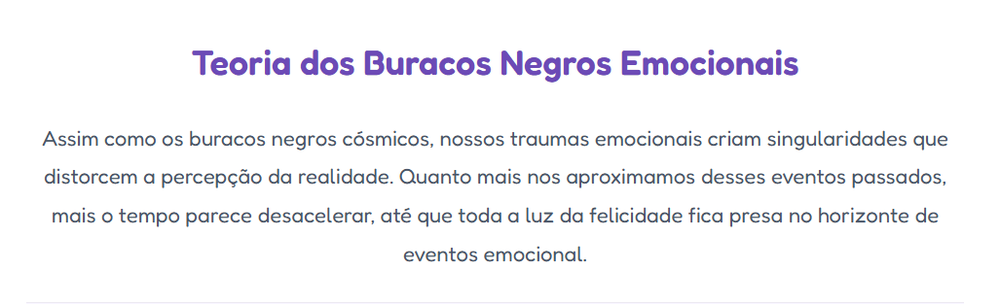

# 🌙 Teorias Absurdas (ou não) 

Inspirado no universo de *Summer Camp Island*

](https://avrilstihler.github.io/Gerador-de-Teorias-Absurdas/))

> _"Às vezes, tudo que a física precisa é de um pouco de purpurina filosófica."_

Este projeto é um **grimoire digital de ideias bizarramente encantadoras**, onde:

- A **gravidade é causada por saudade**  
- As **sombras têm vida própria**  
- E **os sonhos guardam memórias de universos paralelos**

Feito com a estética de **cobertores mágicos, estrelas dorminhocas e cadernos cor-de-rosa**, rabiscados com carinho e caos existencial.

## 🛠️ Tecnologias 

## Como Funciona?

1. Você **entra no site encantado**
2. Clica no botão **"✨ Nova Teoria"**
3. Recebe uma teoria maluca com toque de magia, física e filosofia 

## Exemplo de Teoria
  
| |
|-------------------|
|  |

